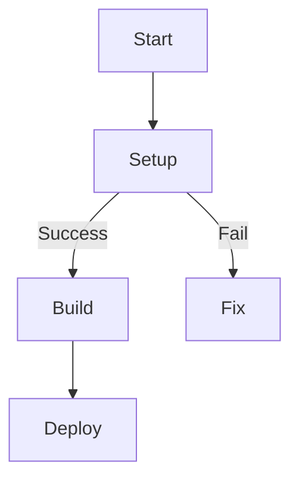

# 🧪 MkDocs Formatting Showcase

Explore advanced formatting features supported by MkDocs Material and `pymdown-extensions`.

---

## 🔔 Admonitions

!!! note "Friendly Reminder"
    You can use note, warning, danger, success, and other callout types.

!!! tip "Did You Know?"
    Admonitions can also be collapsible!

    ```markdown
    !!! tip "Expandable Section"
        More details go here...
    ```

---

## 🔗 Anchored Headings

Every heading includes a permalink 🔗 when `toc.permalink` is enabled in `mkdocs.yml`. Great for sharing deep links.

---

## 😄 Emojis

Use shortcodes like `:rocket:`, `:tada:`, or `:mag:` to add emojis:

:rocket: Rapid launch  
:hammer_and_wrench: Configuration  
:tada: Celebration

---

## 🧷 SuperFences & Syntax Highlighting

```python hl_lines="2"
def greet(name):
    print(f"Hello, {name}!")
```

```bash
mkdocs build --clean
mkdocs serve
```

---

## 🌱 Tabbed Content

=== "Windows"
    Run `dir` to list files.

=== "Linux/macOS"
    Use `ls -la` for a detailed file listing.

=== "PowerShell"
    Try `Get-ChildItem`

---

## 📈 Mermaid Diagrams



---

## 🎨 Custom Badges

Use HTML or inline styling for badges:

<span style="background: #e0f7fa; color: #00796b; padding: 0.2em 0.6em; border-radius: 4px;">Beta</span>  
<span style="background: #fbe9e7; color: #d84315; padding: 0.2em 0.6em; border-radius: 4px;">Deprecated</span>

---

## 🧭 Task Lists

- [x] Install `mkdocs-material`
- [x] Enable extensions
- [ ] Create showcase page
- [ ] Deploy to production

---

## 📦 Details Block (Toggle Disclosure)

??? info "Expand to view usage tips"
    - Use `mkdocs serve` for live preview  
    - Enable `toc.permalink` for anchor links  
    - Add `extra_javascript` to render Mermaid charts  

---

## 📚 References

- [MkDocs Material Docs](https://squidfunk.github.io/mkdocs-material/)
- [Pymdown Extensions](https://facelessuser.github.io/pymdown-extensions/)
- [Mermaid.js](https://mermaid-js.github.io)
